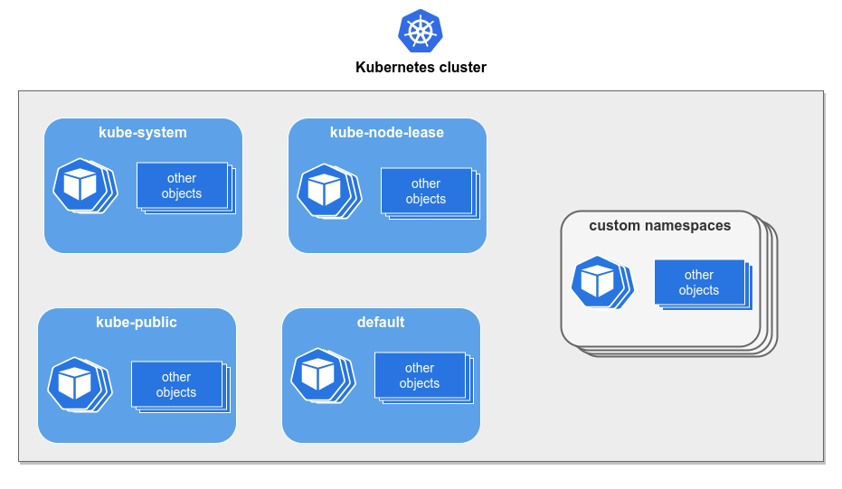

# Namespaces

Namespaces provides a mechanism for **isolating** groups of
resources within a single cluster.

Kubernetes has four initial namespaces:

- default: A default namespace for using after creating a cluster.

- kube-node-lease: Holds Lease objects associated with each node.
  Node leases allow the kubelet to send heartbeats so that the control
  plane can detect node failures.

- kube-public: This namespace is readable by all clients
  (including those not authenticated). This namespace is mostly reserved
  for cluster usage, in case that some resources should be visible and
  readable publicly throughout the whole cluster.

- kube-system: The namespace for objects created by the Kubernetes system.
  **System reserved**.

## Creating a namespace

We are going to create a namespace for our experiment resources
called `k8s-deep-dive`. The definition example is available in
the `namespace.yaml` file.

After running the command above, we can see our namespace by
running `kubectl get namespace`.
