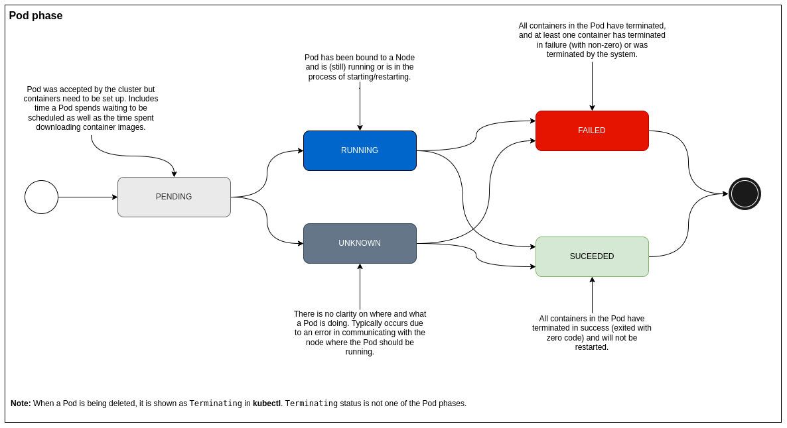

# Pods lifecycle

Pods are designed to be **ephemeral** (disposable). They
are only **scheduled once** in their lifetime. Once a Pod
is scheduled (assigned) to a Node, the Pod runs on that
Node until **it stops or is terminated**.

Pods follow a **defined lifecycle**, starting in the _Pending_
phase, moving through _Running_ and then through either
_Suceeded_ or _Failed_.

Pods **do not self-heal**. If a Pod is scheduled to a node
and it fails, the Pod is deleted. Kubernetes uses a
higher-level abstraction, called a **controller**, that handles
the work of managing the relatively disposable Pod instances.

## Pod lifecycle phase

The phase of a Pod is a simple, high-level summary of **where
the Pod is** in its lifecycle.

## Pod container

Kubernetes also tracks the state of each container inside
a Pod. Once the scheduler assigns a Pod to a Node, the
kubelet starts **creating containers** for that Pod using
the container runtime.

Containers follow a **defined state**, starting in the _Waiting_
state, moving through _Running_, and then through _Terminated_.

You can use container **lifecycle hooks** to trigger events to run
at **certain points** in a container's lifecycle.

## Pod container state

You can track what you container is currently doing by using
container states:

## Init Containers

Init containers are specialized containers that **run before
app containers** in a Pod. They can contain utilities or setup
scripts **not present** in the app container image.

Init containers are **exactly** like regular containers, except:

- Init containers always run to completion.
- Each init container must complete successfully before the next one starts.

## Container probes

Kubernetes periodically **performs a diagnostic** (_probe_) on the
container. This diagnostic helps Kubernetes detect whether a
container is Ok or need some intervention.

### Types of _probes_

- livenessProbe - Indicates whether the **container is running**. If this probe fails,
the kubelet kills the container and the container is subjected to its restart policy.

- readinessProbe - Indicates whether the **container is ready to respond to requests**.
If this probe fails, the endpoints controller removes the Pod's IP address from
the endpoints of Services that match the Pod.

- startupProbe - Indicates whether the **application within the container is started**.
All **other probes are disabled if a startup probe is provided**, until it succeeds.
If the startup probe fails, the kubelet kills the container and the container is
subjected to its restart policy

### Check mechanisms

- exec - Executes a **specified command** inside the container. The diagnostic is
considered successful if the command exits with a status code of 0.

- grpc - Performs a **remote procedure call** using gRPC. The target should implement
gRPC health checks. The diagnostic is considered successful if the status of the
response is SERVING.

- httpGet - Performs **an HTTP GET request against a specified port and path**.
The diagnostic is considered successful if the response has a status code greater
than or equal to 200 and less than 40

- tcpSocket - Performs a **TCP check against a specified port**. The diagnostic is
considered successful if the port is open. If the container closes the connection
immediately after it opens, this counts ashealthy.

### Probe outcomes

- Success - The **container passed** the diagnostic.
- Failure - The **container failed** the diagnostic.
- Unknown - The **diagnostic failed** (no action should be taken, and the kubelet
will make further checks).

To learn more about _Probes_, click [here](https://kubernetes.io/docs/tasks/configure-pod-container/configure-liveness-readiness-startup-probes/#before-you-begin).

## Pod CrashLoopBackoff

When a Pod gets stuck on a restart loop (it tries to
start but crashes and it is restarted over and over again),
Kubernetes **set its state as _CrashLoopBackOff_**.

Kubernetes **will wait an increase back-off time between
restarts** to give you a chance to fix the error. As such,
CrashLoopBackOff is not an error on itself, but indicates
that there is an **error preventing Pod from
starting properly**.

## Pod termination

Pods are designed to be disposable, being **deleted** whenever is needed.
Scalling down your replicas or executing a Deployment rollout are examples
where Pod termination is executed.

It is importart to **gracefully terminate**, avoiding losing request/data during
a termination. When a Pod is marked for termination,the Node **waits** for the
`terminationGracePeriodSeconds` (**30s by default**), expecting the Pod to stop
itself. If the Pod exceeds this period, it is **forcefully killed**.

You can **control** graceful shutdown execution in your application container by
using:

- Linux Signals - When a Pod is marked for termination, a `SIGTERM`
signal is sent to each container. The `SIGKILL` is sent to each
container when forcefully killed.

- PreStop hook - You can either send an HTTP request or execute a command in the
container.
