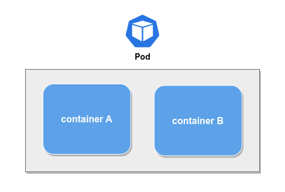
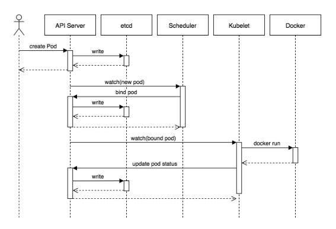

# Pods

Pods are a atomic, group of **one or more containers**, with shared storage
and network resources, and a specification for how to run the containers.

A Pod is **similar** to a set of containers with shared namespaces and
shared filesystem volumes.

Pods are attached to a [container runtime](https://kubernetes.io/docs/setup/production-environment/container-runtimes/)
to run containers. **Docker** is the most commonly known runtime but there
are other options such as _containerd_ and _cri-o_.

## Managing Pods

Pods are generally **not created directly** since they are design
to be **disposable**. Instead, we abstract Pods using _workloads_,
such as _Deployment_, _Job_ or _StatefulSet_.

## Pod lifecycle

It is **very important** to understand _Pod lifecycle_ and how it works.
There is a separed topic where we talk about lifecycle.
You can read it [here](./POD-LIFECYCLE.md).

## Pod creation

The diagram below illustrates how Pods are created in Kubernetes:

## Pod definition

Pods are crated using the Kubernetes specification [v1.Pod](https://kubernetes.io/docs/reference/generated/kubernetes-api/v1.27/#pod-v1-core).
A minimal example can be found in the `pod.yaml` file.
