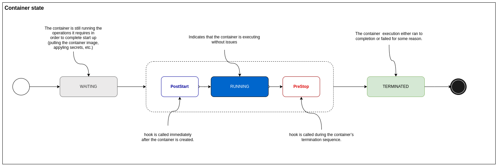

# Pods - Lifecycle, containers, conditions and termination

Pods are designed to be **ephemeral** (disposable). They
are only **scheduled once** in their lifetime. Once a Pod
is scheduled (assigned) to a Node, the Pod runs on that
Node until **it stops or is terminated**.

Pods follow a **defined lifecycle**, starting in the _Pending_
phase, moving through _Running_ and then through either
_Suceeded_ or _Failed_.

Pods **do not self-heal**. If a Pod is scheduled to a node
and it fails, the Pod is deleted. Kubernetes uses a
higher-level abstraction, called a **controller**, that handles
the work of managing the relatively disposable Pod instances.

## Pod lifecycle phase

The phase of a Pod is a simple, high-level summary of **where
the Pod is** in its lifecycle.

## Pod CrashLoopBackoff

When a Pod gets stuck on a restart loop (it tries to
start but crashes and it is restarted over and over again),
Kubernetes **set its state as _CrashLoopBackOff_**.

Kubernetes **will wait an increase back-off time between
restarts** to give you a chance to fix the error. As such,
CrashLoopBackOff is not an error on itself, but indicates
that there is an **error preventing Pod from
starting properly**.

## Pod container

Kubernetes also tracks the state of each container inside
a Pod. Once the scheduler assigns a Pod to a Node, the
kubelet starts **creating containers** for that Pod using
the container runtime.

Containers follow a **defined state**, starting in the _Waiting_
state, moving through _Running_, and then through _Terminated_.

You can use container **lifecycle hooks** to trigger events to run
at **certain points** in a container's lifecycle.

### Pod container state

You can track what you container is currently doing by using
container states:

## Init Containers

Init containers are specialized containers that **run before
app containers** in a Pod. They can contain utilities or setup
scripts **not present** in the app container image.

Init containers are **exactly** like regular containers, except:

- Init containers always run to completion.
- Each init container must complete successfully before the next one starts.
