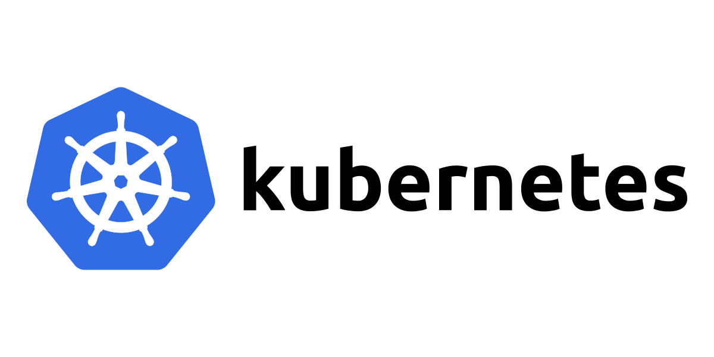

# Kubernetes - Deep dive

In this repository we gonna take a deep dive in the main concepts/components of
Kubernetes, the most adopted container orchestrator nowadays.

## Before you start

To be able to follow the concepts explored here, you need to setup a cluster first.
For instance, you can use the **kind-config.yaml** file to set a local cluster with
[Kind](https://kind.sigs.k8s.io/) by running the
`kind create cluster --config=config/kind-config.yaml` command.

## Sections

- [Architecture](./01-architecture/README.md)
- [Namespaces](./02-namespaces/README.md)
- [Pods](./03-pods/README.md)
