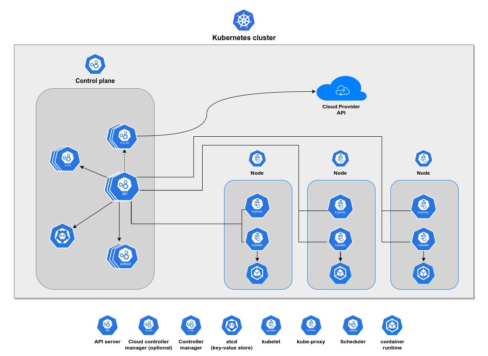

# Kubernetes architecture

A Kubernetes cluster consists of a **control plane** and a set of worker machines
(commonly referred as **nodes**).

The **control plane** manages the worker nodes and pods. Its components make
decisions about the cluster as well as detecting and responding to cluster events.

**Nodes** run containerized applications. Every cluster has
**at least one worker node**.

    

## Components

- **API server** - Works like a "Cluster gateway". Interact with clients
  (kubectl, UI, etc.) and act like a auth gatekeeper.

- **Cloud controller manager** - Lets you link your cluster
  into your cloud provider's API, and separates out the components
  that interact with that cloud platform from components that only
  interact with your cluster. This component is **optional**.

- **Controller manager** - Detect cluster state changes. Watch the shared state
  through the API server and make changes attempting to move the current
  state to the desired state.

- **etcd (the “cluster brain”)** - A key value store. Stores every cluster change
  (when a pod dies, when a new pod is scheduled, etc.) Other control plane resources
  depends on the data store here to take an action.

- **Kubelet** - Interacts with containers and node. Responsible for running pods,
  allocating container resources (CPU, memory, etc.) and starting the pod with
  a container inside.

- **Kube proxy** - Forwards request from services to pods. Has an intelligent
  forwarding logic to balance pod calls between worker nodes.

- **Scheduler** - Watches for newly created Pods with no assigned node and
  selects a node for them to run on. Scheduler just decides on which node
  the new pod will be placed and then send a request to Kubelet
  (that actually does the pod schedule).

- **Container runtime** Engine that run the containers on the hosting operating system.
  The most used container runtimes are [docker](https://www.docker.com/), [containerd](https://containerd.io/)
  and [cri-o](https://cri-o.io/).
